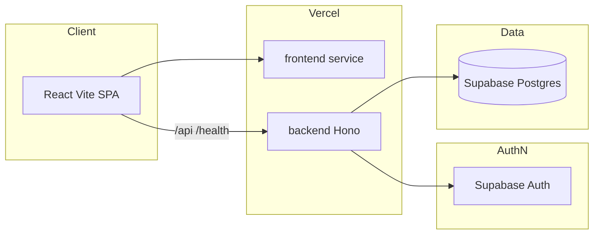
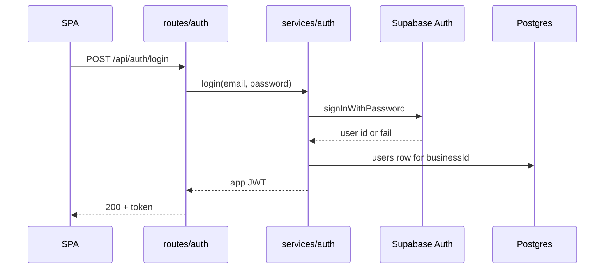
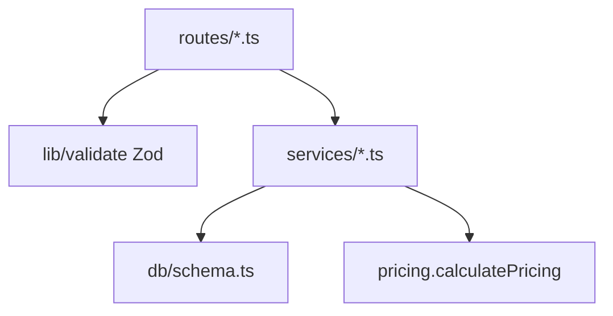

# Architecture

## Overview

Wedding Tapes is an internal sales tool for a wedding photography business. Staff log in, maintain a catalog of services and packages, keep customer records, assemble quotations (proposals), and export PDFs.

The product is a two-service monorepo: a Hono + TypeScript API on Vercel Functions and a React + Vite SPA. Data lives in Supabase Postgres via Drizzle ORM. Passwords live in Supabase Auth; this app stores a profile row (`users`) keyed to the same UUID and issues its own HS256 JWT for API authorization.

Every domain row is scoped by `business_id`. The API never trusts a client-supplied business id or a client-supplied total. Catalog prices are snapshotted onto proposal child rows so later catalog edits cannot rewrite history.

Source of truth for product rules: `wedding_photography_proposal_generator_detailed_SRS.md` (authoritative) and `wedding_photography_proposal_generator_small_scope_MVP.md`. Stack notes and port history: `CLAUDE.md`. Phase plan (partially historical — backend is no longer NestJS): `plan.md`.

## 技术栈

**语言与运行时**
- TypeScript (backend `typescript` ^6, frontend ~6)
- Node.js (Vercel Functions / local `@hono/node-server`)

**框架**
- Hono 4 (API)
- React 19 + Vite 8 + react-router-dom 7
- Vitest (backend unit tests: `src/pricing.spec.ts`)
- oxlint, prettier

**数据存储**
- Supabase Postgres via `drizzle-orm/postgres-js`
- Transaction pooler port 6543, `prepare: false`
- SSL CA via `DATABASE_CA_CERT` (do not put `sslmode` in `DATABASE_URL`)

**基础设施**
- Vercel multi-service (`vercel.json`): `frontend` (Vite) + `backend` (`entrypoint: src/index.ts`)
- Rewrites: `/api`, `/health` → backend; everything else → frontend
- Package manager: pnpm

**外部服务**
- Supabase Auth (`signInWithPassword`, `signUp`, resend verification)
- pdfkit for server-side PDF

## 项目结构

```
Wedding Tapes/
├── backend/
│   ├── src/
│   │   ├── index.ts              # Vercel export default app
│   │   ├── dev-server.ts         # local serve() wrapper — never used on Vercel
│   │   ├── db/                   # postgres-js client + Drizzle schema
│   │   ├── routes/               # thin Hono routers
│   │   ├── services/             # business logic
│   │   ├── schemas/              # Zod request schemas
│   │   ├── middleware/           # JWT auth, error envelope
│   │   ├── lib/                  # jwt, supabase, validate, http-error
│   │   ├── pricing.ts            # pure pricing engine
│   │   ├── pdf.ts                # pdfkit generator
│   │   ├── seed.ts
│   │   └── database/migrations/  # historical TypeORM migrations (not run)
│   ├── drizzle.config.ts
│   └── vercel entry via src/index.ts
├── frontend/
│   └── src/
│       ├── main.tsx, App.tsx
│       ├── api/client.ts
│       ├── auth/
│       ├── pages/
│       ├── components/
│       └── types/
├── vercel.json
├── CLAUDE.md
└── wedding_photography_proposal_generator_*.md
```

**入口点**
- `backend/src/index.ts` — `export default app` (Vercel)
- `backend/src/dev-server.ts` — local port 3333
- `frontend/src/main.tsx` — SPA
- Root `pnpm run dev` — concurrently backend watch + Vite

## 子系统

### HTTP / Hono app
**目的**: CORS, error envelope, mount domain routers under `/api`.
**位置**: `backend/src/index.ts`, `backend/src/routes/`
**关键文件**: `middleware/error.ts`, `middleware/auth.ts`
**依赖**: services, db
**被依赖**: Vercel / `@hono/node-server`

### Domain services
**目的**: Auth, business profile, catalog, customers, proposals (snapshot + persist pricing).
**位置**: `backend/src/services/`
**关键文件**: `proposals.ts`, `auth.ts`, `packages.ts`, `catalog-services.ts`
**依赖**: `db`, other domain *service functions* (not raw tables of another domain)
**被依赖**: routes

### Persistence
**目的**: Drizzle tables + relations; one module-scope postgres client.
**位置**: `backend/src/db/`
**关键文件**: `schema.ts`, `client.ts`, `pg-error.ts`
**依赖**: `DATABASE_URL`, `DATABASE_CA_CERT`
**被依赖**: services, `/health`

### Pricing engine
**目的**: Isolated `calculatePricing` (SRS §17).
**位置**: `backend/src/pricing.ts`
**被依赖**: `services/proposals.ts` via `persistPricing()`
**测试**: `backend/src/pricing.spec.ts`

### PDF
**目的**: `(proposal, business) => Promise<Buffer>` — no DB.
**位置**: `backend/src/pdf.ts`
**被依赖**: `routes/proposals.ts` `POST /:id/generate-pdf` (HTTP 200)

### Frontend SPA
**目的**: Authenticated internal UI.
**位置**: `frontend/src/`
**关键文件**: `api/client.ts`, `pages/CreateProposal.tsx`, `auth/ProtectedRoute.tsx`

## 图表







## 设计决策（代码中实际存在）

- No Nest DI: plain modules and function exports.
- JWT: HS256, `sub` / `businessId` / `email`, no per-request user DB lookup.
- Supabase JS client: `persistSession: false`, `autoRefreshToken: false`, `detectSessionInUrl: false`.
- Money fields are integers (minor units / whole currency as stored — no decimal type in schema).
- `proposal_packages` / `proposal_items` hold snapshotted name, description, unit price.
- Optional line items (`is_optional`) are excluded from subtotal.
- `POST /api/packages` response does not include `items` (historical contract).
- CORS origin: `http://localhost:<port>` only in code (`LOCALHOST_ORIGIN`).
- Historical TypeORM migrations under `backend/src/database/migrations/` are not executed.
