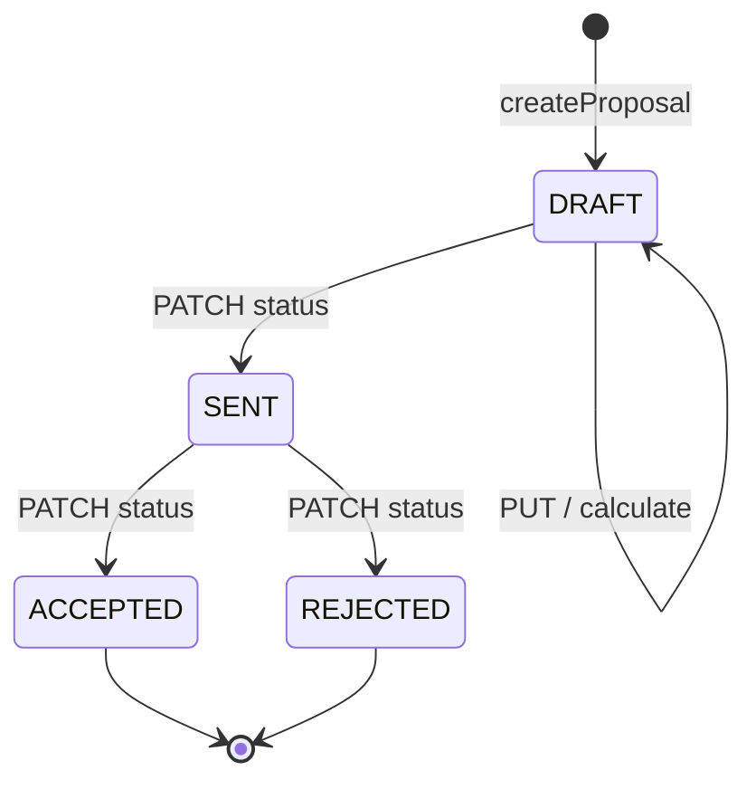
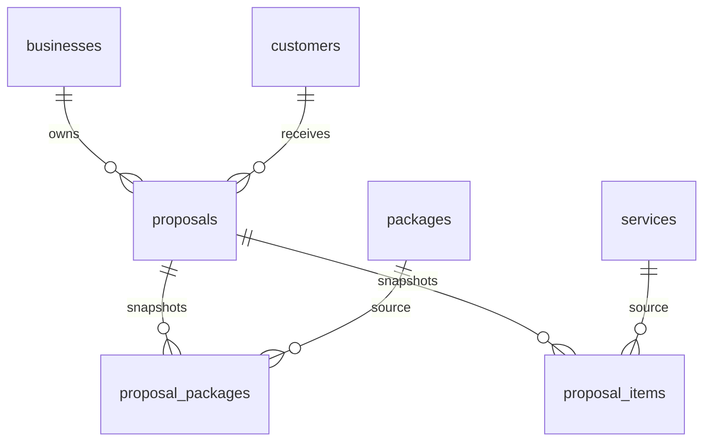

# Proposal

A quotation for one customer's wedding, with snapshotted packages and services, server-computed totals, and optional PDF export.

## What is a Proposal?

Owned by a `business`, points at a `customer`. Holds wedding metadata, discount/tax, and two child collections: `proposal_packages` and `proposal_items`.

**Key traits**:
- Number format `WP-{year}-{4-digit}` unique per business (count-based; not concurrency-safe)
- Status starts `DRAFT`
- PUT and calculate only while `DRAFT` (Conflict otherwise)
- Optional items excluded from subtotal
- Tax on **post-discount** amount (SRS §17)

## Code locations

| Aspect | Location |
|--------|----------|
| Model | `backend/src/db/schema.ts` (`proposals`, `proposalPackages`, `proposalItems`) |
| Service | `backend/src/services/proposals.ts` |
| Routes | `backend/src/routes/proposals.ts` |
| Zod | `backend/src/schemas/proposals.ts` |
| Pricing | `backend/src/pricing.ts` |
| PDF | `backend/src/pdf.ts` |
| UI | `CreateProposal.tsx`, `ProposalPreview.tsx`, `ProposalHistory.tsx` |
| Types | `frontend/src/types/proposal.ts` |

## Key fields

| Field | Description |
|-------|-------------|
| `proposalNumber` | human id |
| `weddingDate` / `weddingLocation` / `numberOfDays` | event |
| `status` | DRAFT, SENT, ACCEPTED, REJECTED |
| `subtotal`, `discountType`, `discountValue`, `discountAmount`, `taxRate`, `taxAmount`, `total` | persisted pricing |
| snapshot cols on children | `packageName`, `unitPrice`, `serviceName`, `priceType`, `isOptional` |

## Invariants

1. **Snapshot**: totals use child `unitPrice`, never live catalog prices.
2. **Tenant**: all finds filter `businessId`.
3. **Optional**: `isOptional` lines omitted from `calculatePricing` service total.
4. **Discount clamp**: `[0, subtotal]`.
5. **Re-activation**: when replacing lines on a draft, existing attached inactive catalog rows may remain; **new** adds must be active.

## Lifecycle

Exact allowed transitions are whatever `updateProposalStatus` currently permits — read that function before documenting extra edges.

## Relationships

